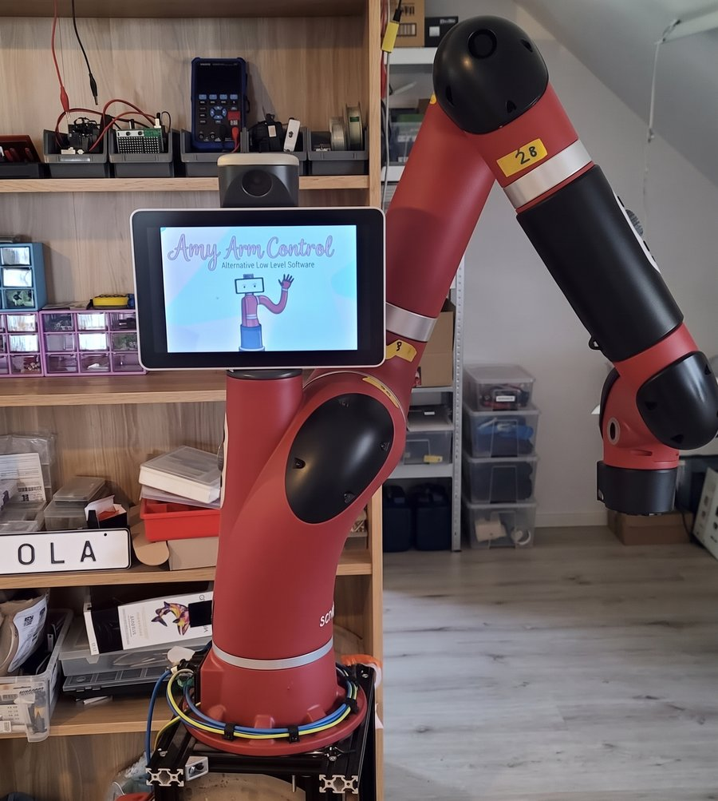
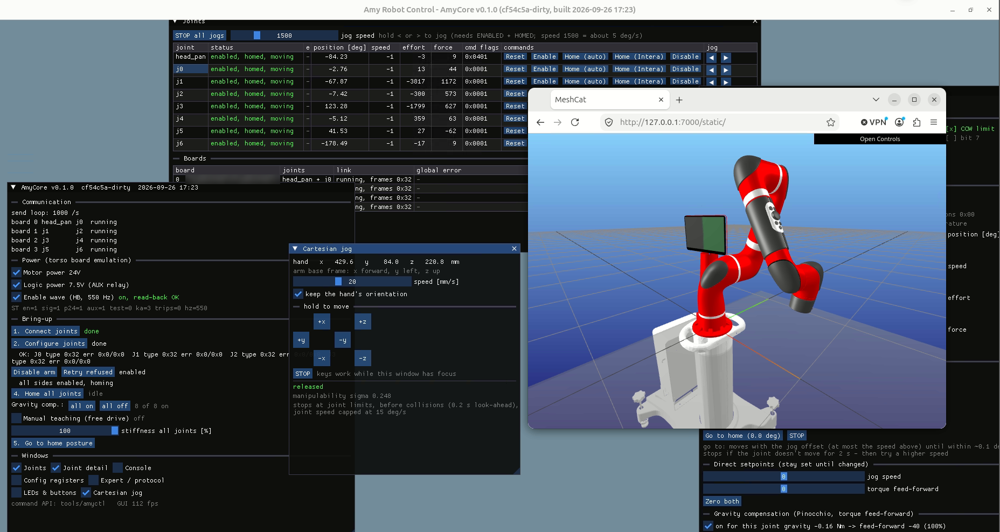
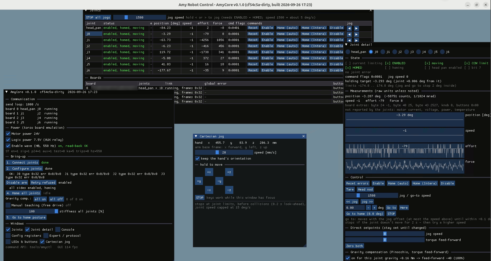

# AmyCore

**Amy Arm** is an alternative low-level control for the Rethink Robotics Sawyer arm. AmyCore is its controller: the
software that runs on the PC and drives the arm.

> [!CAUTION]
> **Very early pre-release. Not production ready.** AmyCore has been proven on exactly one robot (the developer's own
> Sawyer), and only for moving the joints and moving the arm in Cartesian space. Nothing else has been proven to work.
> Expect bugs, missing features and breaking changes. Don't use it for anything that matters.



*The development robot running AmyCore. The photo was edited with AI to tidy up the room in the background.*

AmyCore is an open controller for the **Rethink Robotics Sawyer** arm that doesn't need the original robot PC or Intera
software. It runs on a Linux PC connected to the robot's internal Ethernet and talks directly to the joint controller
boards (JCBs). It speaks the boards' JRCP protocol, which was reverse-engineered for interoperability and is documented
in [docs/JRCP_PROTOCOL.md](docs/JRCP_PROTOCOL.md).

An ESP32 board ([esp32_enable/](esp32_enable/)) takes over the jobs of the missing torso board: it switches the motor
24 V and the 7.5 V logic supply through relays, and generates the square-wave enable signal the joints need.

> [!WARNING]
> **AmyCore moves a real industrial robot arm with no certified safety system.** It is experimental software,
> provided without any warranty (see [LICENSE](LICENSE)). Keep a hardware E-stop that cuts motor power within reach,
> keep people out of the arm's reach, and start with low speeds. You are responsible for operating your robot safely.

## Features

- Joint discovery, TFTP boot and configuration of the joint boards (register tables per board, calibration from each
  board's own DATABLOCK)
- Intera's enable sequence (safety-controller resume, motor power, staggered enable), homing, position hold
- 1 kHz real-time communication thread
- Jogging, coordinated collision-checked joint moves, Cartesian jog of the hand
- Gravity compensation (Pinocchio) with a calibration tool, manual teaching (free drive)
- ImGui service GUI, or headless operation through a command pipe (`tools/amyctl`)
- AmyView: 3D view of the arm in the browser (MeshCat)
- Diagnostics: link state, register dumps, debug-variable stream, fault recorder

## Screenshots

Cartesian jog of the hand, with AmyView showing the arm's live pose in the browser:



The Joint detail window with live state, position, speed, effort and force plots of one joint:



## Status

Very early pre-release (2026-09). Proven on one robot only, the developer's own Sawyer: AmyCore moves the joints and
moves the arm in Cartesian space. Everything else in the feature list above (for example manual teaching, gravity
calibration, collision checking, the diagnostics) is implemented but **not proven**. It hasn't been tried on any other
Sawyer, so other robots, firmware versions or wiring may behave differently.

**A note on pace:** I'm quite busy at the moment, and AmyCore isn't my main priority, so I work on it only in my spare
time. Please be patient with issues and pull requests: replies and fixes may take a while. Thanks for understanding!

## Hardware

- A Sawyer arm (tested with the `mp4` model, joint firmware 5.2.0)
- A Linux PC (tested: Intel NUC, Ubuntu) with a spare Ethernet port wired to the robot's internal network
- Two power supplies: 7.5 V for the logic and 24 V for the motors (details in [docs/HARDWARE.md](docs/HARDWARE.md))
- A LOLIN S2 Mini (ESP32-S2) with two relay channels:
  - GPIO7: enable signal to the joints' enable input. A 5 V push-pull buffer is recommended; the input is a charge pump
    and 3.3 V is marginal.
  - IO11: 24 V motor power relay
  - IO12: 7.5 V logic power relay (normally-open contact)

Connector pinouts, the enable signal and how it's injected into the robot's RJ45: [docs/HARDWARE.md](docs/HARDWARE.md).

## Network setup (once per PC)

The PC's robot port uses a static IP of 192.168.88.8/24. The joint boards boot into a bootloader that asks for an IP by
DHCP, so a DHCP server must serve that port:

```bash
sudo apt install udhcpd
sudo cp udhcpd.conf /etc/udhcpd.conf        # edit "interface" to your robot port (here eno1), pool 192.168.88.10-20
sudo sed -i 's/^DHCPD_ENABLED=.*/DHCPD_ENABLED="yes"/' /etc/default/udhcpd
# udhcpd exits with status 0 if the port has no address yet (PC booted with the robot off): restart it always
sudo mkdir -p /etc/systemd/system/udhcpd.service.d
printf '[Service]\nRestart=always\nRestartSec=5\n' | sudo tee /etc/systemd/system/udhcpd.service.d/restart.conf
sudo systemctl daemon-reload && sudo systemctl enable --now udhcpd
```

AmyCore expects the robot port to be `eno1`. If yours has another name, start AmyCore with `--if <name>` (or change
`DEFAULT_IF` at the top of `amyEth.h`), and use the same name in `/etc/udhcpd.conf`.

For the ESP32, install the udev rule so the board is always `/dev/amy-esp32`:
`sudo cp esp32_enable/99-amy-esp32.rules /etc/udev/rules.d/ && sudo udevadm control --reload`.

## Build

Dependencies: CMake ≥ 3.18, Ninja, a C++20 compiler, SDL2 and OpenGL, and **Pinocchio** (with coal) from robotpkg.
Dear ImGui is fetched automatically, or use a local checkout with `-DIMGUI_DIR=<path>`.

```bash
sudo apt install cmake ninja-build libsdl2-dev
# Pinocchio from robotpkg
sudo mkdir -p /etc/apt/keyrings
curl -fsSL http://robotpkg.openrobots.org/packages/debian/robotpkg.asc | sudo tee /etc/apt/keyrings/robotpkg.asc
echo "deb [arch=amd64 signed-by=/etc/apt/keyrings/robotpkg.asc] http://robotpkg.openrobots.org/packages/debian/pub $(lsb_release -cs) robotpkg" | sudo tee /etc/apt/sources.list.d/robotpkg.list
sudo apt update && sudo apt install robotpkg-pinocchio robotpkg-py312-pinocchio

cmake -G Ninja -B build-robot -DCMAKE_PREFIX_PATH=/opt/openrobots
ninja -C build-robot
```

AmyCore needs Linux capabilities for raw Ethernet, real-time priority and memory locking, and every relink drops them.
Install the one-line sudo rule once, and the build re-applies them automatically (only in `build-robot/`):

```bash
tools/install-setcap-sudoers.sh
# or by hand after every build:
sudo setcap cap_net_raw,cap_net_admin,cap_sys_nice,cap_ipc_lock+ep build-robot/AmyCore
```

Firmware: `cd esp32_enable && pio run -t upload` (PlatformIO). **Flashing resets the ESP32 and drops both relays.**

## Run

With the GUI (a desktop session is needed):

```bash
./build-robot/AmyCore              # add --poweron for a cold start (switches logic and motor power on)
```

Without a window, controlled through `tools/amyctl`:

```bash
# Cold start: switch logic and motor power on, configure and enable the arm (no homing)
./build-robot/AmyCore --headless --arm --poweron > run.log 2>&1 &
# Hot start (robot already powered): the same without --poweron

tools/amyctl wait "^arm enabled" 120    # wait until the arm is up
tools/amyctl                            # status of all joints
tools/amyctl autohome j6                # home joints one at a time
tools/amyctl jog j6 1500 400            # jog: <joint> <value> <ms>
tools/amyctl quit
```

- Without `--headless`, the ImGui GUI opens and has the same functions, plus register editing and plots. In the GUI,
  run the bring-up steps with the numbered buttons (1. Connect joints, 2. Configure joints, 3. Enable arm), or start
  with `--arm` to run them by themselves.
- **Power order:** `--poweron` switches on the 7.5 V logic, then the 24 V motor power at once, gives a short HB test
  pulse (0.97–3.4 s, like the original robot) and waits 20 s for the joints to boot. The 24 V must be on while the
  joints boot: without it, the carpus board (j5 + j6) doesn't start its firmware (tested 2026-09-29). The joints stay
  disabled until the arm is enabled; HB comes on for good once all joints are connected.
- **Board identification:** on a cold start (boards in their bootloader) AmyCore finds the four joint boards by
  IDENTIFY and tells them apart by the `type` in their DATABLOCK (scapula, humerus, ulna, carpus). It saves the
  DATABLOCKs in `AmyConfig/datablock/`, and a hot start takes the boards' MACs from there. So the **first start on a
  new robot must be a cold start** (`--poweron`, or the logic power switched on shortly before).
- Commands go to `/tmp/amycore.cmd`, and status is written to `/tmp/amycore.status` every 200 ms. `tools/amyctl` wraps both.
- **Logic power rules:** keep the 7.5 V logic off for at least 10 s and on for at least 2 min before switching it
  again. AmyCore enforces this.
- j6's multi-turn tracking is off by default; `AMY_J6_MULTITURN=1` turns it on (see [Troubleshooting](#troubleshooting)).

## Configuration

Files in [AmyConfig/](AmyConfig/):

| File | Purpose |
|---|---|
| `intera/`, `intera_full/` | CONFIG register tables per board |
| `parameterALL.csv` | additional register list merged into the tables |
| `joint_calibration.txt` | local corrections on top of each board's DATABLOCK calibration |
| `collision.txt` | collision margins, table plane, obstacles, move speed, contact detection |
| `home_pose.txt` | home posture for "Go to home" |
| `model/sawyer_intera2023.urdf` | kinematic and dynamic model (gravity, Jacobians, collision) |
| `datablock/` | each board's DATABLOCK, saved at a cold start; a hot start takes the boards' MACs from here (robot-specific, not tracked) |

`tools/gravcal.py` fits this robot's link masses and torque offsets from still poses. The results
(`model/sawyer_calibrated.urdf`, `model/gravity_offsets.txt`) are used from the next start.

## 3D view (AmyView)

```bash
python3 -m venv --system-site-packages tools/amyview/venv
tools/amyview/venv/bin/pip install meshcat "numpy==1.26.4"
tools/amyview/amyview.sh            # open the printed URL, e.g. http://127.0.0.1:7000/static/
tools/amyview/amyview.sh --demo     # without AmyCore
```

AmyView only reads `/tmp/amycore.pose` and never talks to the robot.

## Troubleshooting

Known problems on the development robot, and what helped.

**j6: `0x0011 LATCHED MAE_SENSOR_ERROR`, disabled, position 0.** In Intera's model defaults j6 is the only joint with
multi-turn tracking on (`JointMultiturnEnable` = 1). If j6 sits near the 0/360° point of its absolute sensor, homing
carries it across, the tracking loses count and the board latches MAE_SENSOR_ERROR. A reset doesn't clear it.
AmyCore therefore turns j6's multi-turn tracking **off by default** (`AMY_J6_MULTITURN=1` keeps it on). If the fault
is already latched, for example after a run with it on:

1. Disable the arm.
2. Turn j6 by hand a good way away from where it was.
3. Cold boot: switch the 7.5 V logic power off (GUI: "Logic power 7.5V (AUX relay)"), quit AmyCore and wait at least
   10 s. `--poweron` in the next step switches the power on again.
4. Start again, without `AMY_J6_MULTITURN`: `./build-robot/AmyCore --poweron`.

With multi-turn tracking off, j6 configured and homed without the fault after a cold boot (tested 2026-09-25). j6's
behaviour over its full range without multi-turn tracking hasn't been tested.

**A joint is enabled and homed, but gives no torque or ignores jogs.** A joint board drives its motors only when
**both** of its joints are enabled (head_pan + j0, j1 + j2, j3 + j4, j5 + j6). If one side is disabled, for example
j6 after the fault above, its partner goes slack too. Fix the disabled side first.

**A board shows `frames 0/s`, "never sent a joint frame".** The board isn't talking at all: check that its logic power
is on and that it booted, then restart AmyCore.

**No window appears.** `--headless` never opens one; start without it. If AmyCore exits right away, the terminal
says why: `cannot open a raw Ethernet socket` means the binary lost its capabilities after a rebuild (see
[Build](#build)), `ESP32 port not available` means the ESP32 board isn't connected over USB.

## Repository layout

| Path | Contents |
|---|---|
| `main.cpp` | GUI, state machine, 1 kHz comm thread, command API, ESP32 control |
| `amyEth.*`, `sawyerFrames.*`, `jointJCB.h`, `udp_sender.*` | JRCP frames, joint state, UDP/raw Ethernet |
| `gravity.*`, `collision.*` | Pinocchio gravity model, Jacobians, collision checks |
| `linkdiag.*`, `console_log.h` | link diagnostics, console capture |
| `esp32_enable/` | ESP32 firmware (enable wave, relays, watchdog) |
| `tools/` | `amyctl`, AmyView, gravity calibration, register comparison, CONFIG table generator |
| `docs/JRCP_PROTOCOL.md` | protocol reference |
| `docs/HARDWARE.md` | connector pinouts, enable signal (HB) and its injector |

## License

AmyCore is dual-licensed:

- [GNU Affero General Public License v3.0 only](LICENSE), or
- a [commercial license](LICENSE-COMMERCIAL.md) for use where the AGPL's terms don't fit.

Third-party components and their licenses are listed in [NOTICE](NOTICE). Contributions require a CLA, see
[CONTRIBUTING.md](CONTRIBUTING.md).

AmyCore is not affiliated with or endorsed by Rethink Robotics or HAHN Group. "Sawyer", "Intera" and "Rethink Robotics"
are trademarks of their respective owners.
