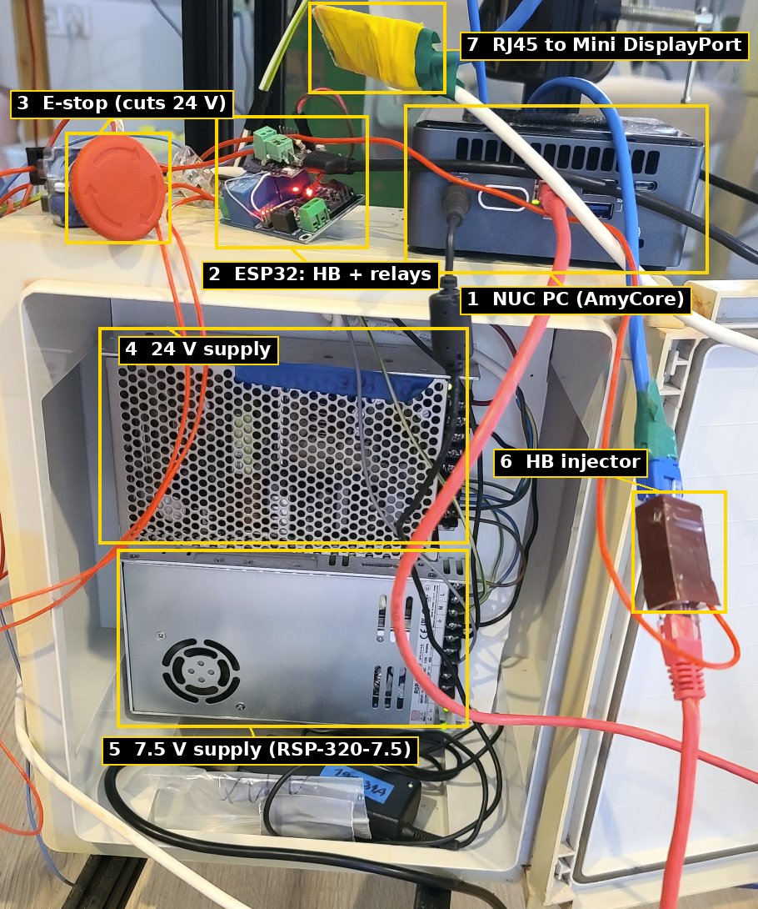
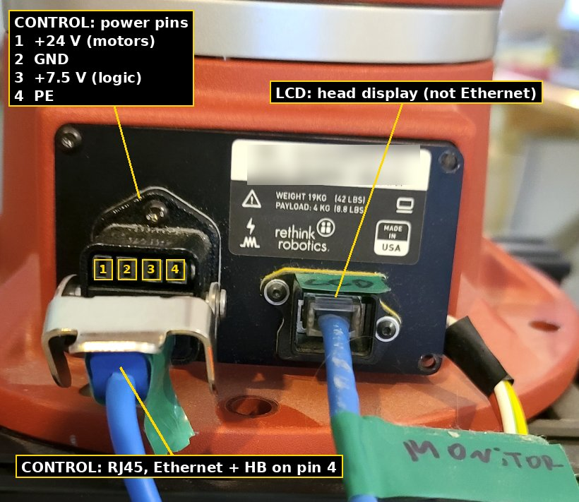

# Hardware: setup, robot base connectors and the HB injector

How AmyCore's PC and the ESP32 enable board connect to the Sawyer arm, as wired on the development robot. The RJ45 wire
colors are the ones inside that robot's own cable; check them on yours before connecting anything.

> [!WARNING]
> This is the wiring of one robot, recorded by hand. Measure before you connect, and keep a hardware E-stop that cuts
> motor power within reach. On the development robot the E-stop cuts **only the 24 V motor supply**: the 7.5 V logic,
> the PC and the ESP32 stay on.

## Working setup

The development robot's controller, replacing the original robot PC:



1. **NUC PC** running AmyCore, connected to the robot's network and, over USB, to the ESP32.
2. **ESP32 board** (LOLIN S2 Mini with relays): generates HB and switches the 24 V and 7.5 V.
3. **E-stop** button: cuts the 24 V motor supply only.
4. **24 V supply** for the motors (see [Power supplies](#power-supplies)).
5. **7.5 V supply** for the logic, MEAN WELL RSP-320-7.5.
6. **HB injector**: puts the ESP32's HB signal onto pin 4 of the Ethernet cable that goes to the robot base (see
   [HB injector](#hb-injector)).
7. **RJ45 to Mini DisplayPort** (passive): connects the robot's head display to the NUC's Mini DisplayPort. The
   robot's LCD port carries DisplayPort over an RJ45 cable. *The adapter's pinout is still being documented and will
   be added later.*

## Base connector panel

The arm's base has two connectors next to each other, where the original controller cables plugged in:

- left, **CONTROL**: a HARTING connector with **4 power pins** on top and an **RJ45** below them: the robot's internal
  Ethernet, plus the enable signal on pin 4;
- right, **LCD**: an RJ45 jack for the head display (not Ethernet).



## CONTROL connector: power pins

Part number noted on the power module: `22.0945.0.009.001.04` (as read from the label; not matched to a HARTING
catalogue number).

Pin 1 of the power pins is on the **left** when you look at the robot's base. Measured on the development robot:

| pin | function |
|---|---|
| 1 | **+24 V** motor supply |
| 2 | **GND** (0 V) |
| 3 | **+7.5 V** logic supply |
| 4 | **PE** (protective earth) |

AmyCore switches the 24 V and the 7.5 V through the ESP32 board's relays (see [README](../README.md#hardware)).

### Power supplies

Without the original controller, the arm needs two supplies. Used on the development robot:

| supply | used | notes |
|---|---|---|
| +7.5 V logic | MEAN WELL **RSP-320-7.5** (7.5 V, 40 A, 300 W) | works |
| +24 V motors | a 24 V, **5 A** supply | **too small**: use a bigger one. The arm's real 24 V current hasn't been measured yet |

Both supplies' 0 V go to GND (power pin 2).

## CONTROL connector: RJ45 (Ethernet and enable signal)

| pin | wire color | function |
|---|---|---|
| 1 | blue | Ethernet (pair 1/2) |
| 2 | dark green | Ethernet (pair 1/2) |
| 3 | yellow | Ethernet (pair 3/6) |
| 4 | violet | **HB: the joints' enable signal** (see below) |
| 5 | — | not connected |
| 6 | brown | Ethernet (pair 3/6) |
| 7, 8 | violet (both on one wire) | not identified yet |

The robot's network is 100 Mbit/s Ethernet, which only uses pins 1, 2, 3 and 6. The spare pins carry the enable
signal.

## HB: the enable signal

The joints only enable while they receive a running square wave on RJ45 pin 4 (in AmyCore's code and GUI: **HB**, or
"enable wave"). A static level means "disabled": the joints report `NO_EXTERNAL_ENABLE` (global error byte 0x08) and
latch an error as soon as they are enabled.

On the original robot, the missing torso board generated it. A 2023 scope trace of the original signal shows a square
wave of about 540 Hz with edges only about 1 V high, on a baseline that climbs from 0 V to over 4 V within about 12 ms.
So the enable input is most likely a **charge pump**: the wave charges a capacitor stage, and its DC output enables
the joint electronics.

AmyCore's ESP32 board ([esp32_enable/](../esp32_enable/)) replaces it:

- **550 Hz, 50 % duty** square wave on **GPIO7** (`SIG_FREQ_HZ`, `PIN_ENABLE_SIG`), held low while stopped;
- it runs only while AmyCore keeps talking to the ESP32 over USB: after 50 ms without a command the wave stops and
  stays off (trip latched) until AmyCore switches it on again;
- the ESP32 counts its own edges and reports the frequency, so AmyCore can check that the wave really runs, and really
  stops.

## HB injector

The PC's Ethernet and the ESP32's enable signal share the robot's RJ45 jack. A small adapter (the "HB injector") sits
between the PC's network cable and the robot:

```
 PC / switch                  HB injector                    CONTROL RJ45 (robot base)
 RJ45 in                                                     RJ45 out
   1 ─────────────────────────────────────────────────────────── 1   Ethernet
   2 ─────────────────────────────────────────────────────────── 2   Ethernet
   3 ─────────────────────────────────────────────────────────── 3   Ethernet
   6 ─────────────────────────────────────────────────────────── 6   Ethernet
   4, 5, 7, 8   not connected
                   ESP32 GPIO7 ── [5 V push-pull buffer] ──────── 4   HB
                   ESP32 GND ──────────────────────────────────── robot GND (CONTROL power pin 2)
```

- **Pass through only pins 1, 2, 3 and 6** from the PC side. Don't connect the PC's pins 4, 5, 7 and 8: the PC's
  network port terminates its unused pins, which would load the HB signal.
- **Buffer:** the ESP32's 3.3 V output works, but is marginal for the charge pump. A 5 V push-pull buffer between GPIO7
  and pin 4 is recommended.
- **Ground reference:** the ESP32's GND must share the robot's 0 V, which is power pin 2 of the CONTROL connector.
  RJ45 pins 7 and 8 aren't identified yet.

## ESP32 board pins

| ESP32 (LOLIN S2 Mini) | connects to |
|---|---|
| GPIO7 | HB (through the injector to RJ45 pin 4) |
| IO11 | relay: robot 24 V motor supply |
| IO12 | relay: 7.5 V logic supply (normally-open contact) |
| USB | AmyCore PC (serial commands, keepalive) |

Relays are active-high (`RELAY_ON_LEVEL` in `esp32_enable/src/main.cpp`).
